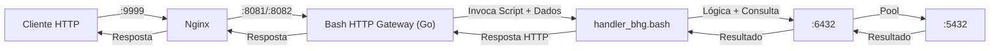

# Rinha de Backend 2023: Bash Rumo ao Olimpo com Gateway Nativo!

Este repositório documenta a jornada de otimização da implementação Bash de [Leandro Proença (leandronsp)](https://github.com/leandronsp) para a [Rinha de Backend 2023 Q3](https://github.com/zanfranceschi/rinha-de-backend-2023-q3), com o objetivo ambicioso de levar o Bash ao Top 5 através da implementação de um **Bash HTTP Gateway (BHG)** nativo.

## A Jornada

1.  **Análise Inicial:** Partimos da implementação original em Bash + `netcat`.
2.  **Otimização Base:** Aplicamos otimizações inspiradas por [Fabio Akita](https://www.akitaonrails.com/), como Batch Insert (`COPY`), `network_mode: host`, e tuning de Nginx/PgBouncer/Postgres. (Veja `propostas_otimizacao_bash.md` e `akita_otimizacoes.md`).
3.  **Identificação do Gargalo:** Mesmo otimizado, o servidor HTTP `netcat` e a execução interpretada do Bash limitavam a performance.
4.  **Inspiração Top 5:** Analisamos soluções de alta performance (Rust, Go, Lean4), que utilizavam servidores HTTP nativos e eficientes. (Veja `analise_solucoes_nativas.md`).
5.  **Proposta BHG:** Propusemos uma arquitetura híbrida com um gateway HTTP leve em Go (BHG) que recebe requisições e invoca scripts Bash para a lógica, combinando performance nativa com a lógica em Bash. (Veja `arquitetura_nativa_bash.md`).
6.  **Protótipo:** Implementamos um protótipo do BHG em Go (`bhg_go/bhg.go`, binário `code/bhg_server`) e adaptamos o handler Bash (`code/handler_bhg.bash`).

## Arquitetura com BHG



*   **BHG (Go):** Lida com conexões HTTP concorrentes, passa dados via env/stdin para o Bash.
*   **Bash (`handler_bhg.bash`):** Recebe dados do BHG, executa a lógica (usando `psql`, `jq`, etc.), e retorna a resposta HTTP completa via stdout.
*   **Nginx, PgBouncer, Postgres:** Mantidos e tunados.

## Como Executar (Docker Compose com BHG)

1.  **Pré-requisitos:** Docker e Docker Compose.
2.  **Build (Opcional):** O binário BHG (`code/bhg_server`) já está pré-compilado. Se precisar recompilar:
    ```bash
    # Instale Go (>= 1.18)
    cd bhg_go
    go build -o ../code/bhg_server bhg.go
    cd ..
    ```
3.  **Executar:**
    ```bash
    # Navegue até o diretório raiz onde está o docker-compose.yml (dentro de 'code/')
    cd code
    docker compose up -d --build
    ```
4.  **Testar:** A API estará disponível via Nginx na porta `9999`.
    *   `POST /pessoas` (com JSON no corpo)
    *   `GET /pessoas/:id`
    *   `GET /pessoas?t=termo`
    *   `GET /contagem-pessoas`

## Conteúdo do Repositório

*   `/code`: Código fonte da aplicação otimizada, incluindo scripts Bash, `docker-compose.yml` atualizado, `nginx.conf`, `init.sql`, o binário `bhg_server` e o handler adaptado `handler_bhg.bash`.
*   `/bhg_go`: Código fonte do protótipo do Bash HTTP Gateway em Go.
*   `index.html`: Site documentando a jornada (visualização local).
*   `*.md`: Arquivos de análise, proposta, estimativa, requisitos, autoria e checklist.

## Autoria

*   **Zeh Sobrinho**
*   **Iag Full Stack Senior DevOp (Manus AI)**

Data: 06 de Maio de 2025

